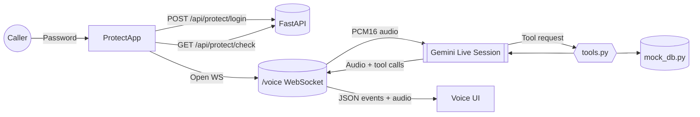

# 🧱 Tech Stack

This project is built from two tightly-coupled layers: a FastAPI backend that streams audio through Google’s Gemini Realtime API, and a modern Next.js frontend that handles the voice UI. Every dependency listed below is actively used in the codebase.

## Backend
- **Python 3.11** – runtime for the API server and Gemini SDK.
- **FastAPI** – main web framework (`voice-ai-backend/main.py`) powering REST endpoints and the `/voice` WebSocket.
- **Uvicorn** – ASGI server used for local dev and Render deployments.
- **google-genai** – official Gemini SDK for managing realtime sessions, function calls, and audio streaming.
- **websockets** – FastAPI’s WebSocket handling relies on this package for bidirectional audio transport.
- **python-dotenv** – loads `GEMINI_API_KEY`, `APP_ACCESS_PASSWORD`, and `ALLOWED_ORIGINS` at startup.
- **pydantic v2** – data validation for request/response payloads.
- **httpx** – async HTTP client bundled with FastAPI utilities.
- **librosa & soundfile** – audio helpers for processing PCM16 chunks (used in the realtime pipeline).

## Frontend
- **Next.js 14 (App Router)** – React framework powering the single-page experience in `voice-ai-frontend/src`.
- **React 18 + TypeScript** – strongly typed UI components, hooks, and utility layers.
- **Tailwind CSS 3** – styling system for the glassmorphism UI.
- **lucide-react** – iconography used across the assistant surface.
- **Custom hooks** – `useWebSocket`, `useAudioRecording`, `useAudioPlayback`, `useSpeechRecognition`, `useTextToSpeech`, etc., orchestrate audio capture, playback, transcripts, and WebSocket messaging.
- **Web APIs** – Web Audio API, MediaRecorder, and Web Speech API are accessed directly inside hooks for real-time microphone and TTS control.

## Shared Tooling
- **npm / Node.js 18** – builds the Next.js frontend and runs lint/type checks.
- **pip** – manages Python dependencies via `voice-ai-backend/requirements.txt`.
- **Render (backend) & Vercel (frontend)** – referenced deployment targets; both expect the above stack with `GEMINI_API_KEY`, `APP_ACCESS_PASSWORD`, and `NEXT_PUBLIC_BACKEND_URL`.

## Application Flow (Step-by-Step)

1. **Authentication Gate**
   - The landing page renders `ProtectedApp`.
   - User submits a password to `POST /api/protect/login`; FastAPI compares it to `APP_ACCESS_PASSWORD` and, on success, issues an HTTP-only cookie (`app_auth=verified`).
   - Refreshes hit `GET /api/protect/check`, giving an instant “authorized/unauthorized” status without retyping the password.

2. **Session Initialization**
   - Once authenticated, `useWebSocket` constructs the backend URL (`NEXT_PUBLIC_BACKEND_URL`) and opens `wss://…/voice` with `binaryType = 'arraybuffer'`.
   - FastAPI creates a session ID, connects to Gemini via `genai.Client.aio.live.connect`, and immediately prompts the model to greet the caller.

3. **Audio Capture & Transport**
   - `useAudioRecording` acquires the microphone, normalizes audio through the Web Audio API, downsamples to 16kHz PCM16, and sends the raw `ArrayBuffer` chunks over the socket.
   - The backend wraps each chunk in `types.LiveClientRealtimeInput` and streams it to Gemini in near real time.

4. **Gemini Realtime Loop**
   - Gemini 2.5 Flash listens to the incoming audio, produces speech back, and can invoke registered tools (function-calling).
   - The backend exposes tool declarations from `tools.py` (list doctors, check slots, book, cancel, end call). When Gemini triggers a tool:
     1. FastAPI receives the `FunctionCall`.
     2. The call is dispatched to the corresponding Python function (`TOOL_FUNCTIONS` map).
     3. The tool function queries/updates the mock database (`mock_db.py`) and returns a structured result plus a spoken summary string.
     4. FastAPI responds to Gemini with `types.LiveClientToolResponse`, giving the model the data it needs to continue speaking naturally.

5. **Delivering Assistant Output**
   - Audio: Gemini streams PCM16 data back. The backend signals the format once (`audio_format` message) and then forwards raw bytes. The frontend ingests them through `useAudioPlayback`, which feeds a Web Audio `AudioBufferSourceNode` for smooth playback.
   - Text: Each Gemini turn also contains textual transcripts. FastAPI emits JSON payloads (`{type: 'transcript', message: ...}`) so the UI can display both user and assistant messages instantly and optionally replay them via browser TTS (`useTextToSpeech`).
   - Tool events: Whenever a tool is executed, FastAPI emits `{type: 'tool_event', tool, status, message}`. The UI shows these in the “Recent Actions” pane, giving the caller visual confirmation of bookings, conflicts, or cancellations.

6. **UI Synchronization**
   - `useMessages` maintains a single source of truth for conversation history, system notices, and assistant replies.
   - Components such as `ConversationHistory`, `SystemEvents`, `DoctorsList`, and `VoiceButton` subscribe to this store, reacting immediately to state changes (connection status, mic levels, tool outputs).
   - When the caller hangs up or Gemini invokes the `end_call` tool, the frontend stops recording, closes the socket, and resets the UI for the next session.
